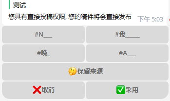
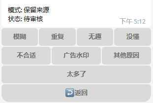
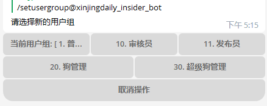

# Xinjingdaily Bot Telegram 投稿机器人

[](https://www.codacy.com/gh/chr233/XinjingdailyBot/dashboard)

[](https://github.com/chr233/XinjingdailyBot/blob/master/license)

[](https://github.com/chr233/XinjingdailyBot/releases)
[](https://github.com/chr233/XinjingdailyBot/releases)


[](https://img.shields.io/github/v/release/chr233/XinjingdailyBot)

[](https://afdian.net/@chr233)

## 心惊报 [@xinjingdaily](https://t.me/xinjingdaily) 自主开发的投稿机器人

心惊报投稿机器人 [@xinjingdaily_bot](https://t.me/xinjingdaily_bot)

承接定制开发, 功能修改

## 功能特性

- [x] 支持文字/图片/音频/视频投稿
- [x] 支持多图投稿
- [x] 支持匿名投稿
- [x] 支持直接发布投稿
- [x] 支持编辑标签
- [x] 支持过滤标签
- [x] 简单用户管理
  - [x] 设置用户组
  - [x] 封禁/解封
  - [x] 封禁记录查询
  - [x] 查看用户投稿统计
  - [x] 匿名回复
  - [x] 检索用户
- [x] 审核超时自动拒绝
- [x] 投稿数量限制
- [x] 获取随机稿件
- [x] 自定义稿件标签
- [x] 自定义拒绝理由
- [x] IPC 接口 (使用命令 /token 获取凭据)
- [ ] 稿件检索
- [ ] 实装用户等级系统
- [ ] TODO

## 安装与使用

从 [Releases](https://github.com/chr233/XinjingdailyBot/releases) 下载编译好的文件以后, 直接运行 XinjingDailyBot.WebAPI 即可

### 升级注意

数据库主键从 `long` 改为了 `int` , 如果从 `1.x` 升级至 `2.x` 后无法正常运行, 请重新创建数据库, 待程序生成数据库结构后使用工具手动导入旧的数据

自 `2.x` 后, 可选 `Sqlite` 作为数据库实现, 在配置文件的 `Database` 节设置 `UseMySQL` 为 `false` 即可

自 `2.0.18.x` 后, 新增自定义标签支持, 之前版本的投稿数据请使用命令 `/fixpost` 进行一次性转换, 否则标签可能不能正确识别

自 `2.1.x.x` 后, 使用了新的稿件表, 之前版本的投稿数据请使用命令 `/mergepost` 进行一次性转换, 否则旧的投稿无法识别

### 配置说明

配置文件为 `appsettings.json` 默认配置如下:

```json
{
  "Logging": {
    "LogLevel": {
      "Default": "Information",
      "Microsoft.AspNetCore": "Warning"
    }
  },
  "AllowedHosts": "*",

  // 调试模式
  "Debug": false,
  // 机器人设置
  "Bot": {
    "BotToken": "",
    "Proxy": null,
    "ThrowPendingUpdates": false,
    "AutoLeaveOtherGroup": false,
    "SuperAdmins": []
  },
  "Channel": {
    "ReviewGroup": "",
    "CommentGroup": "",
    "SubGroup": "",
    "AcceptChannel": "",
    "RejectChannel": ""
  },
  // 消息设置
  "Message": {
    "Start": "欢迎使用 心惊报 @xinjingdaily 专用投稿机器人",
    "Help": "发送图片/视频或者文字内容即可投稿"
  },
  // 数据库设置
  "Database": {
    "Generate": true,
    "UseMySQL": true,
    "LogSQL": false,
    "DbHost": "localhost",
    "DbPort": 3306,
    "DbName": "xjb_db",
    "DbUser": "root",
    "DbPassword": "123456"
  },
  // 投稿设置
  "Post": {
    "EnablePostLimit": true,
    "DailyPaddingLimit": 5,
    "DailyReviewLimit": 5,
    "DailyPostLimit": 5,
    "RatioDivisor": 100,
    "MaxRatio": 10,
    "PureRetuens": true,
    "PureHashTag": true,
    "PureWords": "",
    "PostExpiredTime": 3
  }
}
```

|     节     |        配置项         |   类型   |                     默认值                     | 必须 | 说明                                     |
| :--------: | :-------------------: | :------: | :--------------------------------------------: | :--: | ---------------------------------------- |
|     无     |        `Debug`        |  `bool`  |                    `false`                     |      | 是否开启调试模式                         |
|     -      |           -           |    -     |                       -                        |  -   |                                          |
|   `Bot`    |      `BotToken`       | `string` |                                                |  ✔️  | 机器人 Token                             |
|   `Bot`    |        `Proxy`        | `string` |                     `null`                     |      | 代理地址, 支持 http 和 sock5             |
|   `Bot`    | `ThrowPendingUpdates` |  `bool`  |                    `false`                     |      | 启动时是否忽略机器人离线时产生的 Update  |
|   `Bot`    | `AutoLeaveOtherGroup` |  `bool`  |                    `false`                     |      | 是否自动离开无关群组                     |
|   `Bot`    |     `SuperAdmins`     | `int[]`  |                       []                       |      | 超级管理员 数字 ID 列表                  |
|     -      |           -           |    -     |                       -                        |  -   |                                          |
| `Channel`  |     `ReviewGroup`     | `string` |                                                |      | 审核群组 ID                              |
| `Channel`  |    `CommentGroup`     | `string` |                                                |      | 评论群组 ID                              |
| `Channel`  |      `SubGroup`       | `string` |                                                |      | 闲聊群组 ID                              |
| `Channel`  |    `AcceptChannel`    | `string` |                                                |  ✔️  | 审核通过频道 ID                          |
| `Channel`  |    `RejectChannel`    | `string` |                                                |  ✔️  | 审核拒绝频道 ID                          |
|     -      |           -           |    -     |                       -                        |  -   |                                          |
| `Message`  |        `Start`        | `string` | "欢迎使用 心惊报 @xinjingdaily 专用投稿机器人" |      | 使用 /start 命令显示的欢迎语             |
| `Message`  |        `Help`         | `string` |      "发送图片/视频或者文字内容即可投稿"       |      | 使用 /help 命令显示语句                  |
|     -      |           -           |    -     |                       -                        |  -   |                                          |
| `Database` |      `Generate`       |  `bool`  |                     `true`                     |      | 是否自动生成数据库表                     |
| `Database` |      `UseMySQL`       |  `bool`  |                     `true`                     |      | 是否使用 MySQL 作为数据库实现            |
| `Database` |       `LogSQL`        |  `bool`  |                    `false`                     |      | 是否输出 SQL 日志                        |
| `Database` |       `DBHost`        | `string` |                 `"127.0.0.1"`                  |      | MySQL 主机                               |
| `Database` |       `DBPort`        |  `int`   |                     `3306`                     |      | MySQL 端口                               |
| `Database` |       `DBName`        | `string` |                   `"xjb_db"`                   |      | 数据库名                                 |
| `Database` |       `DBUser`        | `string` |                    `"root"`                    |      | 数据库用户名                             |
| `Database` |     `DBPassword`      | `string` |                   `"123456"`                   |      | 数据库密码                               |
|     -      |           -           |    -     |                       -                        |  -   |                                          |
|   `Post`   |   `EnablePostLimit`   |  `bool`  |                    `false`                     |      | 是否启用每日投稿数量限制                 |
|   `Post`   |  `DailyPaddingLimit`  |  `int`   |                      `5`                       |      | 每日待定稿件数量上限                     |
|   `Post`   |  `DailyReviewLimit`   |  `int`   |                      `5`                       |      | 每日审核中稿件数量上限基数               |
|   `Post`   |   `DailyPostLimit`    |  `int`   |                      `5`                       |      | 每日通过以及未通过稿件数量上限基数       |
|   `Post`   |    `RatioDivisor`     |  `int`   |                     `100`                      |      | 每日投稿数量上限倍率除数                 |
|   `Post`   |      `MaxRatio`       |  `int`   |                      `10`                      |      | 每日投稿数量上限最高倍率                 |
|   `Post`   |     `PureRetuens`     |  `bool`  |                     `true`                     |      | 是否启用回车过滤开关                     |
|   `Post`   |     `PureHashTag`     |  `bool`  |                     `true`                     |      | 是否启用标签过滤开关                     |
|   `Post`   |      `PureWords`      | `string` |                      `""`                      |      | 过滤稿件和 ID 中的特定字符, 以 `\|` 分隔 |
|   `Post`   |   `PostExpiredTime`   |  `int`   |                      `3`                       |      | 稿件过期时间                             |

> 新安装或者数据库结构变动后一定要修改 `DBGenerate` 为 `true`, 会自动生成数据表, 生成完毕后建议禁用以加快启动速度

---

> `SuperAdmins` 机器人超级管理员的 UserID 列表, 覆盖数据库中的设定, 用户 UserID 可以使用命令 /myinfo 获取

---

> `AcceptChannel` 和 RejectChannel 必须为公开频道, 频道名需要加 `@`, 例如 `@xinjingdaily`

---

> `ReviewGroup`, `CommentGroup`, `SubGroup` 不一定需要是公开频道
> 如果是公开群组, 群组名需要加 `@`, 例如 `@xinjingdailychatroom`
> 如果是私有群组, 可以使用命令 /groupinfo 获取群组的信息, 然后设置为群组的 GroupID

---

> 每日投稿数量上限计算方法:
> 倍数 = 用户累计通过稿件数量 / `RatioDivisor` + 1 (倍数不会超过 `MaxRatio`)
> 每日审核中稿件数量上限 = `DailyReviewLimit` \* 倍数
> 每日通过以及未通过稿件数量上限 = `DailyPostLimit` \* 倍数 (计算时排除拒绝理由为重复的稿件)
> 如果 待定稿件数量达到上限, 或者审核中稿件达到上限, 或者投稿稿件达到上限, 则无法投稿

### 权限说明

内置用户组权限如下

| 组 ID | 组名           | 权限                                       | 说明                                                       |
| ----- | -------------- | ------------------------------------------ | ---------------------------------------------------------- |
| 0     | 封禁用户       | 无                                         | 无法直接设置用户到这个组, 被封禁的用户自动被视为此组的成员 |
| 1     | 普通用户       | 投稿,普通命令                              | 默认的用户组                                               |
| 20    | 狗管理         | 投稿,审核投稿,直接发布,普通命令,管理员命令 | 具有所有投稿权限,可以使用普通管理员命令                    |
| 30    | 超级狗管理     | 所有权限(狗管理的权限 + 超级管理员命令)    | 具有所有投稿权限,可以使用所有命令                          |
| 50    | \*超级狗管理\* | 所有权限(狗管理的权限 + 超级管理员命令)    | 具有所有投稿权限,可以使用所有命令                          |

> 管理员仅能对用户组 ID 比自己小的对象(除了自己)进行操作, 例如狗管理(组 ID 为 20)无法操作超级狗管理(组 ID 为 30)

---

> 在 `config.json` 的 `SuperAdmins` 项中定义的管理员拥有最高的权限(组 ID 为 50)
> 虽然权限与超级狗管理(组 ID 为 30)相同, 但是因为具有更高的组 ID, 因此可以操作所有用户(除了自己)

### 命令说明

- 通用命令

> 任何用户组都能使用, 包括封禁用户

| 命令     | 参数 | 说明               |
| -------- | ---- | ------------------ |
| /start   | -    | 显示机器人欢迎语   |
| /about   | -    | 显示机器人欢迎语   |
| /help    | -    | 显示当前可用的命令 |
| /myban   | -    | 查询自己的封禁记录 |
| /version | -    | 显示机器人版本信息 |

- 普通命令

> 拥有`普通命令`权限的用户组可用

| 命令          | 参数 | 说明                                                       |
| ------------- | ---- | ---------------------------------------------------------- |
| /ping         | -    | 机器人存活测试                                             |
| /anonymous    | -    | 仅限私聊, 设置投稿时是否默认使用匿名模式                   |
| /notification | -    | 仅限私聊, 设置投稿被审核后是否接收通知                     |
| /myinfo       | -    | 显示自己的投稿统计信息                                     |
| /myright      | -    | 显示自己的权限信息                                         |
| /admin        | -    | 仅限群聊, 艾特群组中的所有管理员                           |
| /randompost   | -    | 从通过的稿件中随机获取投稿, 非管理员仅能在私聊中使用此命令 |

- 审核命令

> 拥有`审核`权限的用户组可用

| 命令  | 参数                     | 说明                         |
| ----- | ------------------------ | ---------------------------- |
| /no   | 理由                     | 用自定义理由拒绝稿件         |
| /edit | 描述                     | 修改稿件的描述信息           |
| /echo | \[UserName/UserID\] 消息 | 通过机器人向指定用户发送消息 |

- 管理员命令

> 拥有`管理员命令`权限的用户组可用

| 命令        | 参数                     | 说明                            |
| ----------- | ------------------------ | ------------------------------- |
| /groupinfo  | -                        | 仅限群聊使用, 查看群组信息      |
| /userinfo   | \[UserName/UserID\]      | 获取指定用户的信息              |
| /ban        | \[UserName/UserID\] 理由 | 封禁指定用户                    |
| /unban      | \[UserName/UserID\] 理由 | 解封指定用户                    |
| /warn       | \[UserName/UserID\] 理由 | 警告指定用户, 超过 3 次自动封禁 |
| /queryban   | \[UserName/UserID\]      | 显示指定用户的封禁记录          |
| /queryuser  | 关键词 \[页码\]          | 通过关键词查找用户              |
| /sysreport  | -                        | 查看机器人统计信息              |
| /invite     | -                        | 生成审核群的邀请链接            |
| /userrank   | -                        | 显示用户投稿数据排行榜          |
| /postreport | -                        | 显示投稿状态                    |
| /sysreport  | -                        | 显示系统状态                    |
| /message    | -                        | 获取消息详细信息                |

- 超级管理员命令

> 拥有`超级管理员命令`权限的用户组可用

| 命令           | 参数                | 说明                                             |
| -------------- | ------------------- | ------------------------------------------------ |
| /restart       | -                   | 重启机器人                                       |
| /setusergroup  | \[UserName/UserID\] | 修改指定用户的用户组                             |
| /channeloption | 回复投稿使用        | 设置来自特定频道的投稿策略                       |
| /command       | -                   | 设置命令菜单                                     |
| /calcpost      | -                   | 重新计算投稿数量, 校准系统统计误差(误差有待修正) |
| /mergepost     | -                   | 自动将 `2.0.18.x` 以前的旧版稿件数据转换成新版   |

### 数据库配置说明

> 当前部分设置仅能通过修改数据库字段实现, 未来可能会做一些完善

#### 稿件标签自定义

> `tag` 表



| Id  | Name         | Payload | OnText          | OffText | HashTag         | KeyWords   | WarnText            |
| --- | ------------ | ------- | --------------- | ------- | --------------- | ---------- | ------------------- |
| 1   | NSFW         | nsfw    | `#NSFW`         | `#N___` | `#NSFW`         | NSFW       | ⚠️ NSFW 提前预警 ⚠️ |
| 2   | 我有一个朋友 | friend  | `#我有一个朋友` | `#我`   | `#我有一个朋友` | 朋友\|英雄 |
| 3   | 晚安         | wanan   | `#晚安`         | `#晚_`  | `#晚安`         | 晚安       |                     |
| 4   | AI 怪图      | ai      | `#AI 怪图`      | `#A___` | `#AI 怪图`      | #AI        |                     |

| 字段     | 解释                                                                         |
| -------- | ---------------------------------------------------------------------------- |
| Id       | 序号, 可选值 1~16                                                            |
| Name     | 标签名称                                                                     |
| Payload  | callbackData 回调值, 用来识别标签, 每个标签的该字段必须是唯一的              |
| OnText   | 启用标签时按钮显示的文本                                                     |
| OffText  | 禁用标签时按钮显示的文本                                                     |
| HashTag  | 稿件中显示的 HashTag                                                         |
| KeyWords | 标签关键词, `\|`分隔多个关键词, 当稿件文本包含关键词时将会自动启用标签       |
| WarnText | 警告文本, 当激活的标签的警告文本字段不为空时, 稿件发布前将会先发一条警告消息 |

#### 稿件拒绝理由自定义

> `reject` 表



| Id  | Name     | Payload   | FullText                     | IsCount |
| --- | -------- | --------- | ---------------------------- | ------- |
| 1   | 模糊     | fuzzy     | 图片模糊/看不清              | 0       |
| 2   | 重复     | duplicate | 重复的稿件                   | 0       |
| 3   | 无趣     | boring    | 内容不够有趣                 | 1       |
| 4   | 没懂     | confusing | 审核没看懂,建议配文说明      | 1       |
| 5   | 不合适   | deny      | 不合适发布的内容             | 1       |
| 6   | 广告水印 | qrcode    | 稿件包含二维码水印           | 1       |
| 7   | 其他原因 | other     | 其他原因                     | 1       |
| 8   | 太多了   | toomuch   | 今天此类型的稿件的数量太多了 | 1       |

| 字段     | 解释                                                                    |
| -------- | ----------------------------------------------------------------------- |
| Id       | 序号                                                                    |
| Name     | 名称                                                                    |
| Payload  | callbackData 回调值, 用来识别拒绝理由, 每个拒绝理由的该字段必须是唯一的 |
| FullText | 完整的拒绝理由文本                                                      |
| IsCount  | 是否计入每日投稿上限                                                    |

#### 用户群组自定义

> `group` 表



| Id  | Name           | DefaultRight |
| --- | -------------- | ------------ |
| 0   | 封禁用户       | 0            |
| 1   | 普通用户       | 17           |
| 10  | 审核员         | 19           |
| 11  | 发布员         | 21           |
| 20  | 狗管理         | 55           |
| 30  | 超级狗管理     | 247          |
| 50  | \*超级狗管理\* | 247          |

| 字段         | 解释             |
| ------------ | ---------------- |
| Id           | 序号             |
| Name         | 群组名称         |
| DefaultRight | 群组内用户权限值 |

> 用户组 ID 大的用户可以修改用户组 ID 小的用户的用户组
